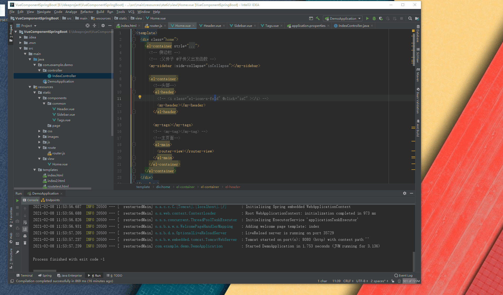
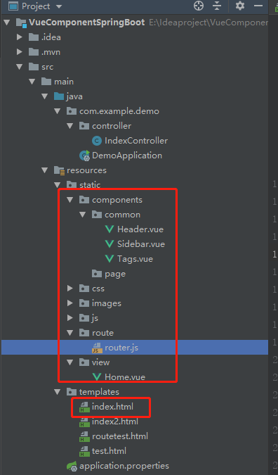

> 为了提高系统开发，使用vue组件开发方便，但是系统本身不需要前后端分离，使用vue脚手架前后端分离又显得重，所以决定使用静态方式，嵌入到springboot中，方便使用
>
> 这里我花了些时间参照了一些vue模板，打造了一个简易的后台管理系统，很干净，可以直接用


# 效果




# 目录结构





# 创建index.html

与vue cli的 index.html 和App.vue文件类似，引入了`httpVueLoader.js`组件工具，`vue-router302.js`路由工具和路由js文件

创建的bus中转对象主要是为了sidebar和header之间的数据通信，方便sidebar显示隐藏

```html
<!DOCTYPE html>
<html>

<head>
    <meta charset="utf-8" />
    <meta name="viewport" content="width=device-width, initial-scale=1">
    <title>demo</title>
</head>

<body>
<div id="app">
    <router-view></router-view>
</div>
<!-- 引入 Vue 相关 的 JS 文件 -->
<script src="js/vue.js"></script>
<link rel="stylesheet" href="css/element-ui-index.css">
<link rel="stylesheet" href="css/main.css">
<link rel="stylesheet" href="css/global.css">

<script src="js/element-ui-index.js"></script>
<script src="js/utils.js"></script>
<script src="js/param.js"></script>
<script src="js/httpVueLoader.js"></script>
<script src="js/vue-router302.js"></script>
<script src="route/router.js" type="text/javascript" charset="utf-8"></script>
<script type="text/javascript">
    Vue.use(httpVueLoader);
    var vue = new Vue({
        router
    }).$mount('#app')
    // 中转对象 负责组件间通信
    var bus = new Vue()

</script>
</body>

</html>
```


# 路由router.js文件

负责创建组件 和路由配置

```js
// 注册组件
const Home = httpVueLoader('view/Home.vue');
var Header = httpVueLoader('components/common/Header.vue');
Vue.component('my-header', Header);
var Sidebar = httpVueLoader('components/common/Sidebar.vue');
Vue.component('my-sidebar', Sidebar);
var Tags = httpVueLoader('components/common/Tags.vue');
Vue.component('my-tags', Tags);

//路由
const Foo = {
    template: '<div>foo</div>'
};
const Bar = {
    template: '<div>bar</div>'
};
const routes = [
    /*     {
            path: '/',
            redirect: '/foo'
        }, */
    {
        path: '/',
        component: Home,
        meta: { title: '系统首页' },
        children: [{
            path: '/foo',
            component: Foo,
            meta: { title: 'foo' }
        },
            {
                path: '/bar',
                component: Bar,
                meta: { title: 'bar' }
            },
        ]
    },];
const router = new VueRouter({
    routes // (缩写) 相当于 routes: routes
})
```


# Home页面组件

首页布局组件

```vue
<template>
  <div class="home">
    <el-container style="height: 100%">
      <!-- 侧边栏 -->
      <!-- :父传子 @子传父出发函数 -->
      <my-sidebar ></my-sidebar>

      <el-container>
        <!--头部-->
        <el-header>
          <!-- <i class="el-icon-s-fold" @click="isC" ></i> -->
          <my-header></my-header>
        </el-header>

        <my-tags></my-tags>
        <!-- <my-tag></my-tag> -->
        <!--主页面-->
        <el-main>
          <router-view></router-view>
        </el-main>
      </el-container>
    </el-container>
  </div>
</template>

<script>
    module.exports = {
        data() {
            return {
                tagsList: [],
                isCollapse: true,
            };
        },
        /* components: {
                // 将组建加入组建库
                "my-header": "url:../components/Header.vue",
              }, */
        created() {
            // 只有在标签页列表里的页面才使用keep-alive，即关闭标签之后就不保存到内存中了。
            bus.$on("tags", (msg) => {
                console.log("home....bus...on");
                console.log(msg);
                let arr = [];
                for (let i = 0, len = msg.length; i < len; i++) {
                    msg[i].name && arr.push(msg[i].name);
                }
                this.tagsList = arr;
            });
        },
        methods: {
            /* isC() {
                        console.log('Home....isC')
                        this.isCollapse = !this.isCollapse
                    } */
        },
    };
</script>

<style scoped>
  .home {
    font-size: 24px;
    height: 100%;
    background-color: #ffffff;
    /*font-weight: bold;*/
  }

  .el-header,
  .el-footer {
    background-color: #fff;
    color: #fff;
    text-align: left;
    line-height: 60px;
    margin-bottom: 5px;
    box-shadow: 10px 5px 10px #ddd;
  }

  .el-main {
    background-color: #fff;
    color: #333;
    text-align: center;
    line-height: 160px;
  }

  body > .el-container {
    margin-bottom: 40px;
  }

  .el-container:nth-child(5) .el-menu,
  .el-container:nth-child(6) .el-menu {
    line-height: 260px;
  }

  .el-container:nth-child(7) .el-menu {
    line-height: 320px;
  }

  .el-scrollbar__wrap {
    overflow-x: hidden;
  }
</style>

```


# Header组件

```vue
<template>
  <div class="header">
    <!-- 折叠按钮 -->
    <div class="collapse-btn" @click="isC">
      <i v-if="!isCollapse" class="el-icon-s-fold"></i>
      <i v-else class="el-icon-s-unfold"></i>
    </div>
    <div class="header-right">
      <div class="user-avator">
        
      </div>
      <!-- 用户名下拉菜单 -->
      <el-dropdown class="user-name" trigger="click">
        <span class="el-dropdown-link">
          {{ username }}
          <i class="el-icon-caret-bottom"></i>
        </span>
        <el-dropdown-menu slot="dropdown">
          <a
                  href="#"
                  target="_blank"
          >
            <el-dropdown-item>项目仓库</el-dropdown-item>
          </a>
          <el-dropdown-item divided command="loginout"
          >退出登录</el-dropdown-item
          >
        </el-dropdown-menu>
      </el-dropdown>
    </div>
  </div>
</template>

<script>
    module.exports = {
        data() {
            return {
                msg: "hello world!  Header",
                username: "zhangsn",
                isCollapse: false
            };
        },
        methods: {
            isC() {
                console.log("Header...isC");
                this.isCollapse = !this.isCollapse;
                //触发事件
                bus.$emit('collapse', this.isCollapse);
            },
        },
    };
</script>

<style scoped>
  .header {
    position: relative;
    box-sizing: border-box;
    width: 100%;
    height: 70px;
    font-size: 22px;
    color: #fff;
    display: inline-block;
  }

  .el-icon-s-fold,.el-icon-s-unfold {
    color: #000;
  }


  .collapse-btn {
    float: left;
    padding: 0 10px;
    cursor: pointer;
    line-height: 60px;
  }
  .header .logo {
    float: left;
    width: 250px;
    line-height: 60px;
  }
  .header-right {
    float: right;
    padding-right: 10px;
  }

  .el-dropdown-link {
    color: #000;
    font-size: 16px;
    cursor: pointer;
  }
  .el-dropdown-menu__item {
    text-align: center;
  }

  .user-avator {
    display: inline-block;
    line-height: 60px;
  }
  .user-avator img {
    width: 40px;
    height: 40px;
    border-radius: 50%;
    line-height: 60px;
    vertical-align: middle;
  }
</style>
```


# Sidebar组件

```vue
<template>
    <div class="sidebar">
        <el-scrollbar>
            <el-menu
                    router
                    :default-active="onRoutes"
                    :collapse="isCollapse"
                    background-color="#324157"
                    text-color="#bfcbd9"
                    active-text-color="#20a0ff"
                    unique-opened
                    class="sidebar-el-menu"
            >
                <el-menu-item index="/" style="text-align: center">
                    <span slot="title"><h1>后台管理系统</h1></span>
                </el-menu-item>
                <el-menu-item index="/foo">
                    <i class="el-icon-setting"></i>
                    <span slot="title">导航四</span>
                </el-menu-item>
                <el-menu-item index="/bar">
                    <i class="el-icon-setting"></i>
                    <span slot="title">导航四</span>
                </el-menu-item>
                .................
            </el-menu>
        </el-scrollbar>
    </div>
</template>

<script>
    module.exports = {
        //props: ["side-collapse"],
        data() {
            return {
                isCollapse: false,
            };
        },
        computed: {
            onRoutes() {
                console.log("onRoutes...");
                console.log(this.$route);
                return this.$route.path.replace("/", "");
            },
        },
        created() {
            // 通过 Event Bus 进行组件间通信，来折叠侧边栏
            // on监听事件
            bus.$on("collapse", (msg) => {
                console.log("sidebar...bus");
            this.isCollapse = msg;
            //bus.$emit("collapse-content", msg);
        });
        },
        /*watch: {
            sideCollapse: function (old, val) {
                this.isCollapse = val;
            },
        },*/
    };
</script>

<style scoped>
    .sidebar {
        display: block;
        left: 10px;
        top: 70px;
        bottom: 0;
        overflow-y: scroll;
        background-color: rgb(50, 65, 87);
    }

    .el-scrollbar {
        height: 100%;
        width: 100%;
        background-color: rgb(50, 65, 87);
    }

    .el-menu {
        background-color: #d3dce6;
        color: #333;
        text-align: left;
        line-height: 200px;
    }
    .sidebar::-webkit-scrollbar {
        width: 0;
    }
    .sidebar-el-menu:not(.el-menu--collapse) {
        width: 250px;
    }
    .sidebar > ul {
        height: 100%;
    }
</style>

```


# application配置

配置一下静态资源路径

```properties
#在构建URL时添加到视图名称前的前缀（默认值：classpath:/templates/）
spring.thymeleaf.prefix=classpath:/templates/
# 添加此处配置通过controller跳转页面时将自动拼接后缀名
spring.thymeleaf.suffix=.html
# 定义匹配静态资源路径
spring.mvc.static-path-pattern=/**
# 定义静态资源位置
spring.resources.static-locations=classpath:/META-INF/resources/,classpath:/resources/,classpath:/static/,classpath:/public/
spring.thymeleaf.check-template-location=true 
spring.thymeleaf.cache=false
```


# Controller配置

```java
@Controller
public class IndexController {

    @GetMapping("/page")
    public String page() {
        // back前面不写 斜杠
        System.out.println("into index ...");
        return "index";
    }
}
```


至此，配置完成